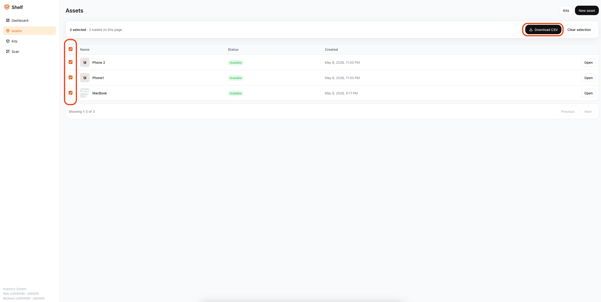
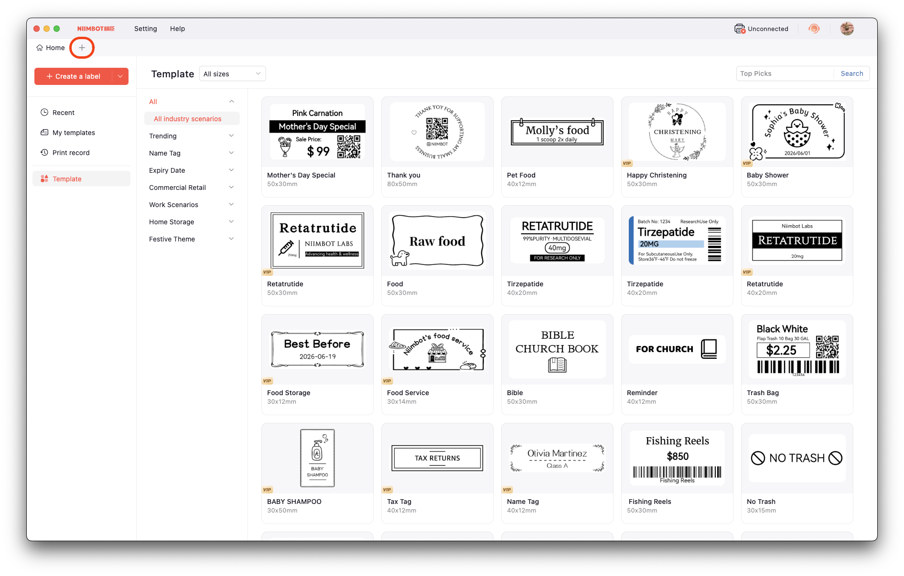
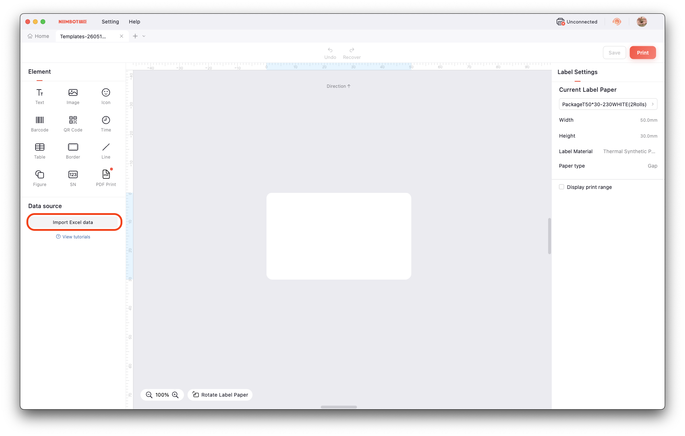
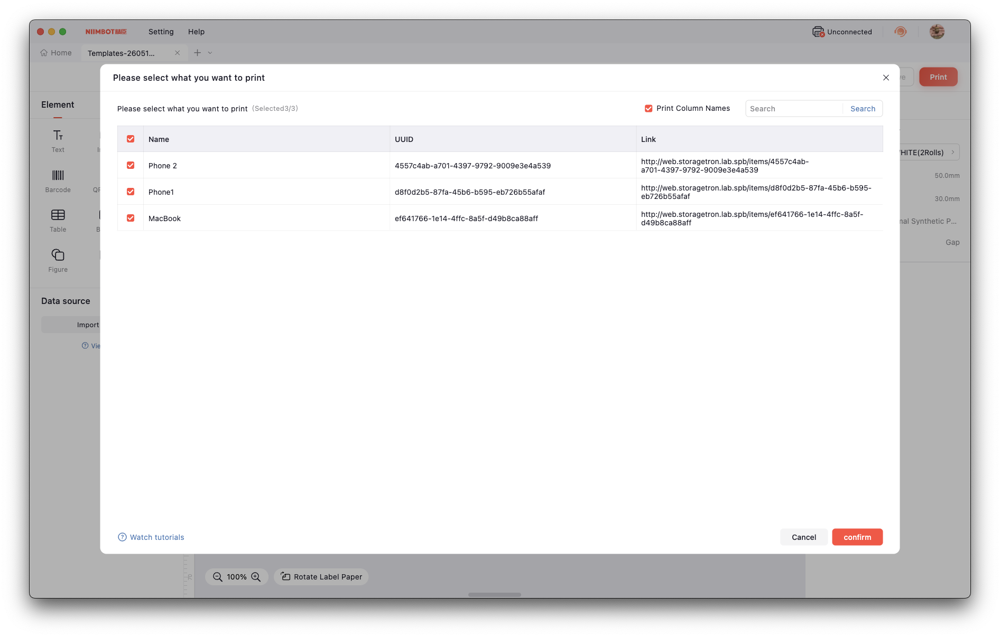
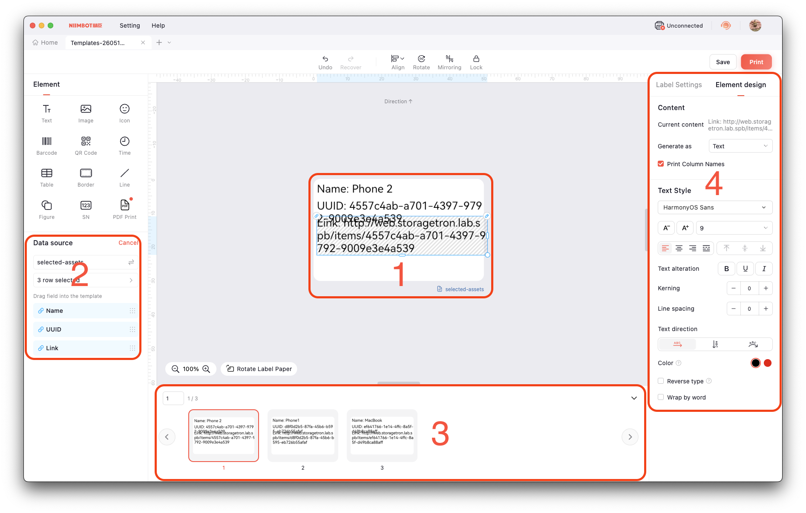

# Storagetron

## Run

```
docker compose up --build
```

## Usage

### Create item

```
curl -X POST localhost:8080/items \
  -H "Content-Type: application/json" \
  -d '{"name":"Laptop"}'
```

### List items

```
curl localhost:8080/items
```

### Get item

```
curl localhost:8080/items/{id}
```

### Delete item

```
curl -X DELETE localhost:8080/items/{id}
```

### Upload photo

```
curl -X POST localhost:8080/items/{id}/photos
```

### Scan

```
curl localhost:8080/scan/{code}
```

## Planned features

### Must

* mobile scanner UI
* PDF / CSV / XLS generator for item / container / location

### Good to have

* full-text search (Postgres tsvector)
* versioning (history of moves)
* ClickHouse for scan analytics
* label printer integration (NIIMBOT)
* custom grouping with tags

## HLD

```
     [ Web UI (Next.js / React / Whatever) ]
                       │
                       ▼
                   [ API (Go) ]
                       │
         ┌─────────────┴──────────┐
         ▼                        ▼
[ Postgres / Mysql ]        [ MinIO (S3) ]
     (metadata)             (photos/files)
```

### Points for HLD

* Postgres = source of truth
* MinIO = blob storage only
* API = all logic
* IDs are QR-friendly (UUID / shortid)
* Everything printable = queryable in one request

### Entities

* items -> physical objects
* containers -> boxes / kits
* locations -> rooms / shelves
* item_container -> many-to-many
* photos
* labels (QR/barcode values)
* custom_fields

### Storage logic

* Item - minimal entity
* Box - simple aggregation point
* Shelf / Wardrobe - bigger aggregation point
* Room - storage point
* City (maybe with address)
* Country

## Printing instructions with NIIMBOT

### PC/MAC

You can print all needed labels in a batch with official NIIMBOT app

1. You need to create right batch. To do so, mark needed assets with check box and click button to export CSV/XLSX



2. Open NIIMBOT app and click "+" button to create new template for labels



3. After this we can import out exported Excel file to NIIMBOT



4. You will be asked to choose items to use in your template



5. Form to setup your template will be shown. Where you can see several zones

1 - Exactly your label with actual size 

2 - Data source with selected columns (you can enable/disable them here)

3 - Preview carousel

4 - Single element settings (here you can change display type: QR, BAR code, text, etc.)



6. As the last step you can print it with Print button
